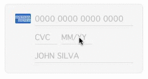

ETCardView
========
If you need a UI to display and validate credit cards, just use this ready to use component.

**ETCardView** is an automatic UI for credit cards, providing card recognition for current and popular flags. The component currently does the following:

- Credit card number recognition
	- American Express
	- Diners
	- Visa
	- MasterCard
- Field validation
- Tab navigation
- Layout customization

If you need to add new cards, just go to source and add, for each card:

- Regex
- Name
- Image (128x80)

That's it! Remember that we don't send your data anywhere, we are just providing the UI.


Installation
--------
Clone this repo and copy the folder **ETCardView** into your Xcode project.

How-to
--------



**ETCardView** can be user both programmatically or loaded automatically from a nib.

### Nib

If you are going to load it from a nib, just load a standard `UIView` from the elements panel and change its class to `ETCardView`. If you need to reference it on code, just make an IBOutlet out of it:

`@property (strong, nonatomic) IBOutlet ETCardView *cardView;`

### Programmatically

Programmatically, just alloc it and set its frame:

```
[[ETCardView alloc] initWithFrame:CGRectMake(0.0, 0.0, 280.0, 140.0)];
```

As you can see, the ideal format for this view is 280x140, but you are free to resize it to any size you want.

### Getters

There are some properties you can have access to. Accessible at anytime, just KVO them. 

- `@property (strong, nonatomic, readonly) NSString *cardFlag;`
- `@property (strong, nonatomic) IBOutlet UITextField *cardNumber;`
- `@property (strong, nonatomic) IBOutlet UITextField *cardCVC;`
- `@property (strong, nonatomic) IBOutlet UITextField *cardExpiration;`
- `@property (strong, nonatomic) IBOutlet UITextField *cardPersonName;`

Support
--------
Just open an issue on Github and we'll get to it as soon as possible.

About
--------
**ETCardView** is brought to you by Trilha.
